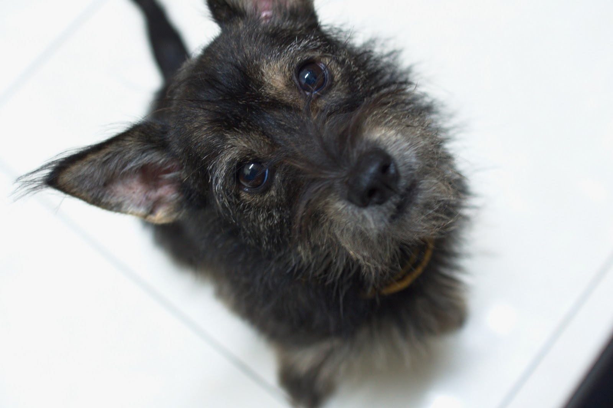
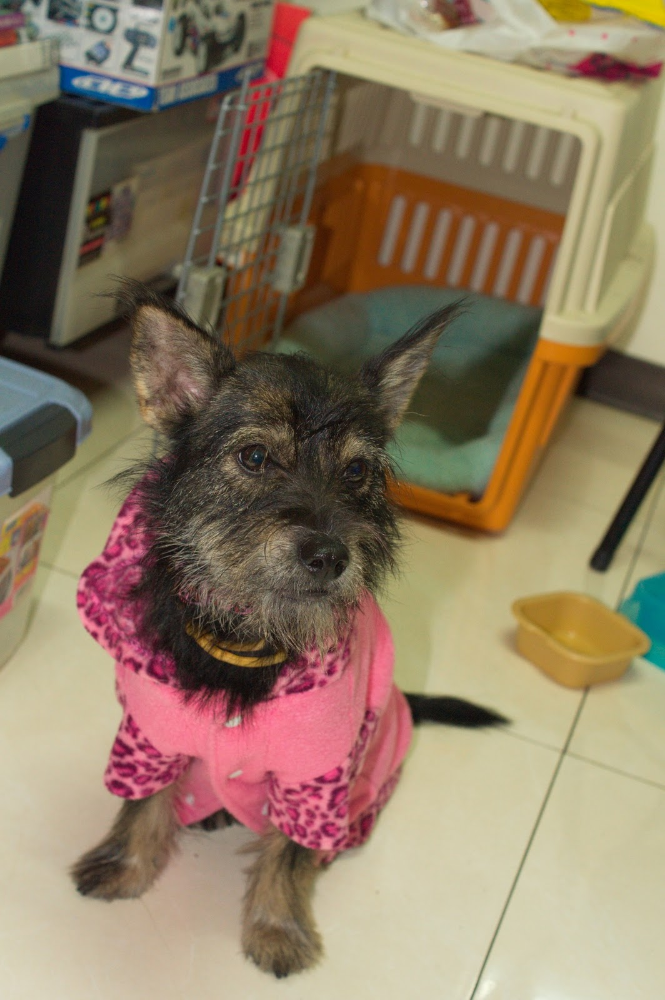

### 關於 Ginny
2012.01.12 家裡多了新成員 ginny(吉妮)。 ginny 跟 morning 都是同一個乾媽教出來的，所以跟 morning 一樣，就是「乖」。

不過他很膽小，像跟屁蟲整天跟在我旁邊，只有他以為我要帶他出門時會高興的衝來衝去，其他時間都乖乖坐著，不理他他也不自己去玩，跟在乾媽家形容的不太一樣，有空再去找一些玩具給他試試看。

關籠也不會亂叫，只有偶而會發出小小聲要我們放他出來撒嬌的叫聲。

定點上廁所，原本會失誤，經他乾媽指點，用零食鼓勵一次而已，竟然就學會自己進廁所大小便，希望是真的學會，不是蒙到的。

