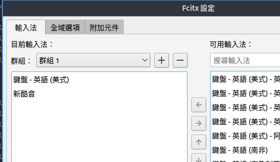
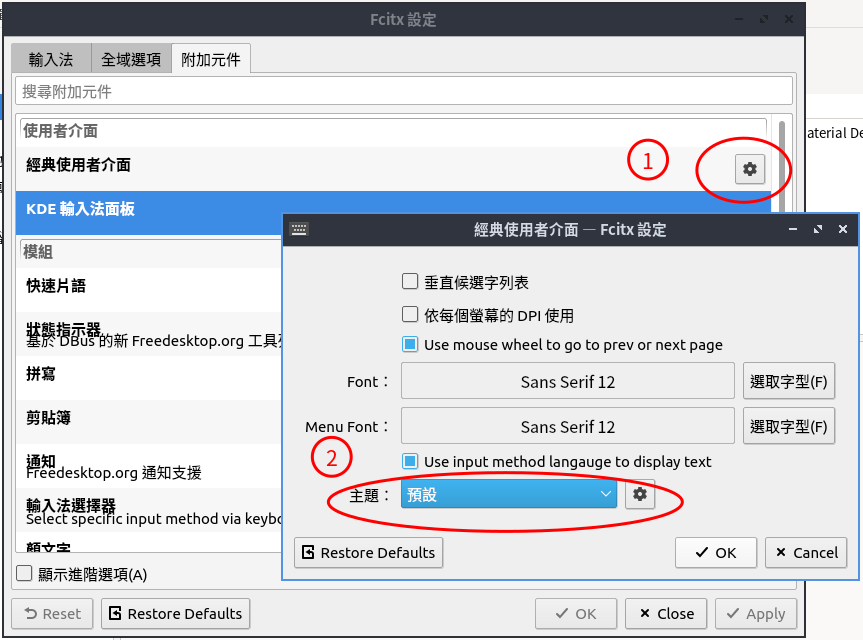
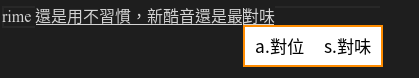

::: danger
會想改用 fcitx5 是因為 lubuntu 21.04 
的 fcitx 的新酷音某天開始給我發神經了，在 vscode 
以及瀏覽器app每次打字一定要送出兩個以上的中文字，才有辦法輸出，不然字就會被吃掉...
:::

首先移除 fcitx

``` bash
sudo apt remove fcitx-*
sudo apt autoremove
sudo apt install fcitx5 fcitx5-chewing
```
ps:  fcitx5-chinese-addons 如果沒其他中文輸入法需求，建議不要安裝

執行選單 偏好設定/Fcitx 5 設定，加入新酷音


如果 fcitx5 不會自動啟動，執行下面命令
::: bash
cp /usr/share/applications/org.fcitx.Fcitx5.desktop ~/.config/autostart/
:::

漂亮的 fcitx5 佈景
``` bash
sudo apt install fcitx5-material-color
```


rime 還是用不習慣，中文輸入法還是新酷音還是最對味，尤其是打特殊符號 ★ ■ ♂


