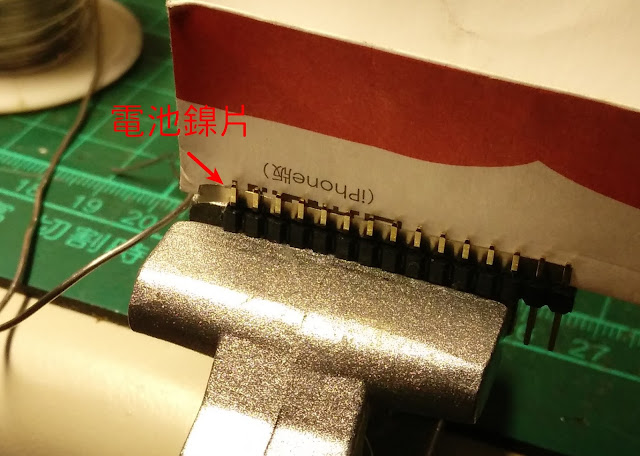

Arduino 系列的 Nana 體積小又有 USB，其實可以取代 UNO。買過他的兩種 IO擴充板，裝上去體積變成跟 Uno 一樣大 >< 傻眼。 
  
以下是自製的最精簡 IO擴充(板...? 應該連板子都稱不上） ，機器手臂、雙足機器人用這樣就綽綽有餘。  
  
1.買杜邦雙排排針，把兩排排針分別全部焊在一起。以前用過電線焊，只是很醜。後來改用電池鎳片，可以比較好焊。  

#### 2.排針焊好的樣子........   以下要非常注意，因為.... 最困難的部份...........做好了，哈哈

  3.把他擺在 nano 數位接腳那邊，把電子積木的腳插上去就固定好了，電源直接接在 Vin、Gnd，完成。 整排導通的排針，記得從 nano 拉 5V 跟 Gnd 過來就搞定了。

 
ps:突然想到， **Nano 的排針要買未焊接的版本自己焊，因為我的排針跟原廠顛倒**，原廠也是可以用，只是要翻過去用，就看不到 IO port 的標誌印刷了。
