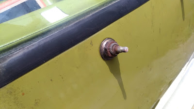
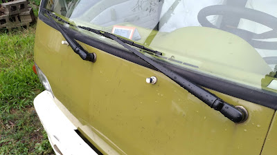
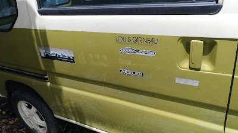

##  小金..繼續小搞搞..
  
小金回家隔天就進廠修冷氣，放了快兩星期才回來（這師技術很好，但是不能趕他，趕他會生氣 :p）。黑干、熱排、壓縮機、管路全換了。

接著自己小搞搞，不過雨刷馬達螺絲都卡死了，拆不下來，清潔後灌滿黃油，防塵蓋蓋回去，希望不要壞，不然要拆就麻煩了。

雨刷臂拆下，重新噴漆(恐龍牌消光黑，我很節儉的，有什麼就用什麼 :p)。

  

清除貼紙，原車貼紙一大堆有塑膠的還有紙材質，有些很好撕，有些全部碎光光...　動用了刮刀、去膠水、吹風機、蒸氣高壓清洗機，發現的的不同情況要用不同工具才好處理，一招是沒辦法走天下的。

  
2018/07/03

原車加裝的第三煞車燈壞了，所以就買了一個來換。結果才發現原來是加裝的第三煞車燈在尾燈那邊的線根本沒接。 接好之後發現買來的第三煞車燈附的吸盤，根本比 LED 還要低，粘上去晃一晃就掉下來。

  

  

只好用 3D 列印兩個底座，再用 3M 汽車用雙面膠粘上去。

  

搞完之後，發現尾門有一個沒有接的接頭，所以就到 FB 問問那是什麼接頭，最後查到是第三煞車燈的接頭.... 這就是人生啊，之前白接線了。老車就是這樣，都搞不清楚那是第幾手做的，還是原廠預留的。

  

  

  

2018/07/05

爬文發現很多小金的空濾都裝錯，副廠的尺寸都不合，所以拆開確認一下。小金要檢查空濾，竟然要拆到進氣岐管，上蓋才拿的起來，實在是很OX的設計。

  

一檢查果然差很多，左邊有一條縫很大，引擎可能都吃沙了.... 先用小D防撞條堵起來蓋上，以後再研究怎麼改良，或是乾脆直接換改裝品。

  

  

2018/07/08

  

安裝好前門跟尾門的遙控中控，中門缺電極零件，所以就先不安裝了。

  

 通用槍型中控馬達

  

 前門中控馬達安裝

  

 尾門中控馬達安裝

  

雨水會滴到油箱蓋，兩邊加個小D防撞條，調整一下油箱蓋鎖，讓他密合一點不要鬆動

  

  

  

2018/07/14

改裝中門門電極，這樣才能導電到中門、才能裝中控。

  

中門中控馬達裝法

有拆到的順便換成不鏽鋼螺絲 M6\*16 

  

  

2018/08/03  陸續小搞搞，日期就不詳細紀錄啦

  

  

板金破洞，除鏽、上鋅粉底漆、用FRP補，補土、上漆。 上完漆有70分，還可接受。

  

  

看這個日本老車修復的影片亂搞的。

  

  

收一些備料，都比原車的漂亮，想換再慢慢換

  

後照鏡，後保險桿桿拆下來練習噴漆，我發現要磨平最難，不會是老花所以才磨不平吧？？

明明感覺磨平了，中塗漆一噴上去就現形 T\_T 

  

  

  

順便挖洞上倒車雷達

超過95度會有聲音警示的水溫表，終於可以知道小金真正的溫度狀況了

  

  

清節氣門，本來想清怠速馬達的，研究很久才知道，小金好像沒有怠速馬達。他的冷車提速在節氣門上，是機械式有水路通過。
