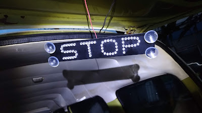
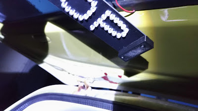
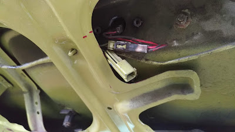

##  小金..繼續小搞搞..

2018/07/03

原車加裝的第三煞車燈壞了，所以就買了一個來換。結果才發現原來是加裝的第三煞車燈在尾燈那邊的線根本沒接。 接好之後發現買來的第三煞車燈附的吸盤，根本比 LED 還要低，粘上去晃一晃就掉下來。

只好用 3D 列印兩個底座，再用 3M 汽車用雙面膠粘上去。

  
搞完之後，發現尾門有一個沒有接的接頭，所以就到 FB 問問那是什麼接頭，最後查到是第三煞車燈的接頭.... 這就是人生啊，之前白接線了。老車就是這樣，都搞不清楚那是第幾手做的，還是原廠預留的。

