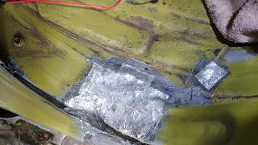
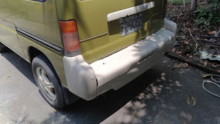

### 2018/07/05
####  小金--空氣濾清器

爬文發現很多小金的空濾都裝錯，副廠的尺寸都不合，所以拆開確認一下。小金要檢查空濾，竟然要拆到進氣岐管，上蓋才拿的起來，實在是很OX的設計。

  
一檢查果然差很多，左邊有一條縫很大，引擎可能都吃沙了.... 先用小D防撞條堵起來蓋上，以後再研究怎麼改良，或是乾脆直接換改裝品。
  

### 2018/07/08
#### 中控
安裝好前門跟尾門的遙控中控，中門缺電極零件，所以就先不安裝了。

通用槍型中控馬達

前門中控馬達安裝

尾門中控馬達安裝

雨水會滴到油箱蓋，兩邊加個小D防撞條，調整一下油箱蓋鎖，讓他密合一點不要鬆動

### 2018/07/14
#### 土砲加裝中門電極
改裝中門電極，這樣才能導電到中門、才能裝中控。

中門中控馬達裝法

有拆到的順便換成不鏽鋼螺絲 M6\*16
 

### 2018/08/03  
#### 陸續小搞搞，日期就不詳細紀錄啦

板金破洞，除鏽、上鋅粉底漆、用FRP補，補土、上漆。 上完漆有70分，還可接受。

看這個日本老車修復的影片亂搞的。

收一些備料，都比原車的漂亮，想換再慢慢換

後照鏡，後保險桿桿拆下來練習噴漆，我發現要磨平最難，不會是老花所以才磨不平吧？？

明明感覺磨平了，中塗漆一噴上去就現形 T\_T 

順便挖洞上倒車雷達

超過95度會有聲音警示的水溫表，終於可以知道小金真正的溫度狀況了

清節氣門，本來想清怠速馬達的，研究很久才知道，小金好像沒有怠速馬達。他的冷車提速在節氣門上，是機械式有水路通過。
